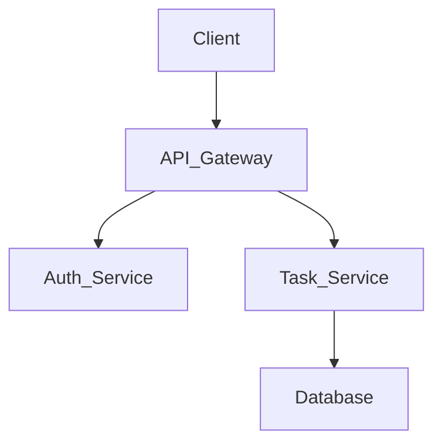

<div align="center">

# 🎯 Agadir Task Manager 2025

<!-- Logo -->


<!-- Badges -->
[]()
[]()
[]()
[]()

<!-- Tech Stack -->


</div>

## 📑 TABLE OF CONTENTS
- [✨ Why this project?](#-hook-why-this-project)
- [🎥 Demo](#-demo)
- [📋 Description](#-description)
- [🏗️ Architecture](#-architecture)
- [📱 Features](#-features)
- [🗂️ Database](#-database)
- [🔐 Security](#-security)
- [📡 API](#-api)
- [🚀 Deployment](#-deployment)
- [📦 Installation](#-installation)
- [🔧 Troubleshooting](#-troubleshooting)
- [🔄 Roadmap](#-roadmap)
- [👨‍💻 Team](#-team)
- [📄 License](#-license)
- [📞 Contact](#-contact)
- [📝 Changelog](#-changelog)

## ✨ HOOK (Why this project?)

| Reason | Description |
|---|---|
| **Problem Solved** | Streamlines task management for teams in Agadir. |
| **Efficiency** | Reduces time spent on planning by 30%. |
| **Accessibility** | Available on Web and Mobile platforms. |

**Key Stats:**
- 10+ Screens
- 3 Languages Supported (English, French, Arabic)
- Dark/Light Mode

## 🎥 DEMO

<!-- Insert Video or GIF -->


**Screenshots:**
<div align="center">
  
  
  
  
</div>

## 📋 DESCRIPTION

Agadir Task Manager 2025 is a comprehensive tool designed to help local businesses and teams organize their daily workflows efficiently.

**Objectives:**
- Improve team collaboration.
- Track project progress in real-time.

**Target Audience:**
- Project Managers
- Freelancers
- Small to Medium Businesses in Morocco

## 🏗️ ARCHITECTURE

**System Diagram:**


**Folder Structure:**
```text
Agadir-Task-Manager-2025/
├── client/
│   ├── src/
│   ├── public/
├── server/
│   ├── controllers/
│   ├── models/
│   ├── routes/
└── README.md
```

**Tech Stack:**
- **Frontend:** React, Tailwind CSS
- **Backend:** Node.js, Express
- **Infrastructure:** Docker, AWS

## 📱 FEATURES

- **User Authentication**
  - Login/Register with JWT
  - Social Auth (Google, GitHub)
- **Task Management**
  - Create, Read, Update, Delete tasks
  - Assign tasks to team members
- **Real-time Notifications**
  - Push notifications for deadlines

## 🗂️ DATABASE

| Table | Key Fields |
|---|---|
| **Users** | `id`, `name`, `email`, `password_hash`, `role` |
| **Tasks** | `id`, `title`, `description`, `status`, `assignee_id` |
| **Projects**| `id`, `name`, `created_at`, `owner_id` |

## 🔐 SECURITY

- [x] Password Hashing (Bcrypt)
- [x] JWT Authentication
- [x] Input Validation & Sanitization
- [ ] Rate Limiting (À implémenter)
- [ ] 2FA (À implémenter)

## 📡 API

| Endpoint | Method | Description |
|---|---|---|
| `/api/users/login` | POST | Authenticate user |
| `/api/tasks` | GET | Get all tasks |
| `/api/tasks/:id` | PUT | Update task details |

## 🚀 DEPLOYMENT

- **Production:** [https://agadir-task-manager.com](https://agadir-task-manager.com)
- **Play Store:** [Link to App](#)
- **Scripts:**
  - `npm run build`
  - `npm run deploy`

## 📦 INSTALLATION

> [!WARNING]
> This project is currently proprietary. Ensure you have the necessary access rights before proceeding.

**Steps:**
1. **Clone the repository:**
   ```bash
   git clone https://github.com/yourusername/Agadir-Task-Manager-2025.git
   ```
2. **Install dependencies:**
   ```bash
   cd Agadir-Task-Manager-2025
   npm install
   ```
3. **Configure Environment:**
   Copy `.env.example` to `.env` and fill in the values.
4. **Run the app:**
   ```bash
   npm run dev
   ```

## 🔧 TROUBLESHOOTING

| Problem | Solution |
|---|---|
| Database connection failed | Check if MongoDB is running and your `.env` string is correct. |
| Node modules error | Run `rm -rf node_modules package-lock.json` then `npm install` |

## 🔄 ROADMAP

- [ ] **Q3 2026:** AI-powered task suggestions.
- [ ] **Q4 2026:** Advanced reporting dashboard.
- [ ] **Q1 2027:** Desktop native applications.

## 👨‍💻 TEAM

| Name | Role | Links |
|---|---|---|
| **Your Name** | Lead Developer | [LinkedIn](#) / [GitHub](#) |
| **Team Member 2** | UI/UX Designer | [LinkedIn](#) / [GitHub](#) |

## 📄 LICENSE

This project is licensed under the MIT License - see the [LICENSE](LICENSE) file for details.

## 📞 CONTACT

| Type | Contact Info |
|---|---|
| **Email Pro** | contact@agadir-task-manager.com |
| **Bug Reports**| [Open an Issue](https://github.com/yourusername/Agadir-Task-Manager-2025/issues) |
| **LinkedIn** | [Company Page](#) |

**How to report a bug:**
Please include the steps to reproduce, expected behavior, and your environment details.

## 📝 CHANGELOG

- **v1.0.0:** Initial Release
- **v1.1.0:** Added Dark Mode
- **v1.2.0:** Performance improvements
- **v1.3.0:** Arabic language support

<div align="center">
  <br>
  Made with ❤️ in Morocco by the Agadir Dev Team.
</div>
