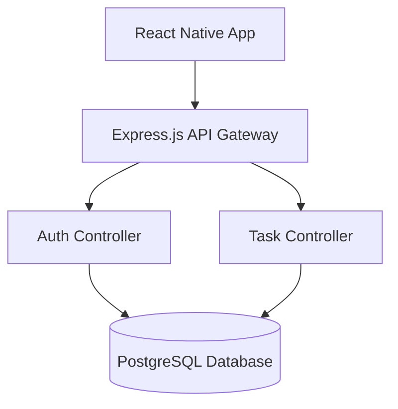

<div align="center">

# 🎯 Agadir Task Manager 2025

<!-- Logo -->


<!-- Badges -->

[]()
[]()
[]()

<!-- Tech Stack -->


</div>

## 📑 TABLE OF CONTENTS

- [✨ Why this project?](#-hook-why-this-project)
- [🎥 Demo](#-demo)
- [📋 Description](#-description)
- [🏗️ Architecture](#-architecture)
- [📱 Features](#-features)
- [🗂️ Database](#-database)
- [🔐 Security](#-security)
- [📡 API](#-api)
- [🚀 Deployment](#-deployment)
- [📦 Installation](#-installation)
- [🔧 Troubleshooting](#-troubleshooting)
- [🔄 Roadmap](#-roadmap)
- [👨‍💻 Team](#-team)
- [📄 License](#-license)
- [📞 Contact](#-contact)
- [📝 Changelog](#-changelog)

## ✨ HOOK (Why this project?)

| Reason             | Description                                                      |
| ------------------ | ---------------------------------------------------------------- |
| **Problem Solved** | Manage daily tasks effectively from your mobile device.          |
| **Simplicity**     | Clean React Native UI with robust backend for fast interactions. |
| **Accessibility**  | Available natively on mobile (Android/iOS).                      |

**Key Stats:**

- 6 Mobile Screens (Home, Login, Register, Dashboard, Task List, New Task)
- Full-stack TypeScript/JavaScript environment
- Relational data structure with PostgreSQL

## 🎥 DEMO

<!-- Insert Video or GIF -->


**Screenshots:**

<div align="center">
  
  
  
  
</div>

## 📋 DESCRIPTION

Agadir Task Manager 2025 is a full-stack mobile application that allows users to register, log in securely, and manage their tasks. It features a React Native frontend and a Node.js/Express backend connected to a PostgreSQL database.

**Objectives:**

- Provide a smooth mobile experience for task tracking.
- Ensure secure user authentication and data persistence.

**Target Audience:**

- Individuals and professionals looking for a simple native mobile task manager.

## 🏗️ Architecture

**System Diagram:**



**Folder Structure:**

```text
Agadir-Task-Manager-2025/
├── backend/
│   ├── src/
│   │   ├── config/       # Database config
│   │   ├── controllers/  # Auth & Task controllers
│   │   ├── middlewares/  # JWT Authentication
│   │   ├── models/       # Sequelize models (User, Task)
│   │   ├── routes/       # API endpoints
│   │   └── services/
│   └── package.json
├── mobile/
│   ├── src/
│   │   ├── api/          # Axios configuration
│   │   ├── context/      # React Context (TaskContext)
│   │   ├── hooks/        # Custom hooks (useAuth, useTasks)
│   │   ├── screen/       # App screens (Dashboard, Login, etc.)
│   │   └── utils/        # Token storage
│   └── package.json
└── README.md
```

**Tech Stack:**

- **Frontend:** React Native (v0.82.1), TypeScript, React Navigation
- **Backend:** Node.js, Express.js
- **Database:** PostgreSQL with Sequelize ORM

## 📱 FEATURES

- **User Authentication**
  - Registration and Login with JWT (JSON Web Tokens)
  - Secure token storage using AsyncStorage
- **Task Management**
  - List all user-specific tasks
  - Create new tasks with title, description, and due date
  - Update task details
  - Mark tasks as 'done' or 'pending'
  - Delete tasks

## 🗂️ DATABASE

| Table     | Key Fields                                                    | Description                                                                                  |
| --------- | ------------------------------------------------------------- | -------------------------------------------------------------------------------------------- |
| **Users** | `id`, `name`, `email`, `password`                             | Stores user credentials and profile. Password is encrypted.                                  |
| **Tasks** | `id`, `title`, `description`, `status`, `due_date`, `user_id` | Stores task data. `status` is an ENUM ('pending', 'done'). `user_id` references Users table. |

## 🔐 SECURITY

- [x] Password Hashing (Bcrypt)
- [x] JWT Authentication & Protected Routes Middleware
- [x] CORS Enabled
- [ ] Environment variables for secrets (`.env`)

## 📡 API

### Auth Routes

| Endpoint    | Method | Description                      |
| ----------- | ------ | -------------------------------- |
| `/register` | POST   | Register a new user              |
| `/login`    | POST   | Authenticate user and return JWT |

### Task Routes (Require Authentication)

| Endpoint          | Method | Description                               |
| ----------------- | ------ | ----------------------------------------- |
| `/tasks`          | GET    | Retrieve all tasks for the logged-in user |
| `/tasks`          | POST   | Create a new task                         |
| `/tasks/:id`      | PUT    | Update an existing task                   |
| `/tasks/:id`      | DELETE | Delete a specific task                    |
| `/tasks/:id/done` | PATCH  | Update task status to done/pending        |

## 🚀 DEPLOYMENT

- **Frontend:** Can be built for Android/iOS via React Native CLI.
- **Backend:** Node.js server starts via `node server.js`.

## 📦 INSTALLATION

**Steps:**

1. **Clone the repository:**

   ```bash
   git clone https://github.com/yourusername/Agadir-Task-Manager-2025.git
   cd Agadir-Task-Manager-2025
   ```

2. **Backend Setup:**

   ```bash
   cd backend
   npm install
   # Configure your PostgreSQL connection in backend/src/config/DataBase.js or .env
   npm run start\ Task # or node server.js
   ```

3. **Mobile Setup:**
   ```bash
   cd ../mobile
   npm install
   # Run on Android
   npm run android
   # Run on iOS (requires Mac)
   npm run ios
   ```

## 🔧 TROUBLESHOOTING

| Problem                    | Solution                                                                                         |
| -------------------------- | ------------------------------------------------------------------------------------------------ |
| Database connection failed | Ensure PostgreSQL is running and credentials are correct. Check `backend/src/config/DataBase.js` |
| Metro Bundler error        | In `mobile/`, run `npm run start -- --reset-cache`                                               |

## 🔄 ROADMAP

- [ ] Add Push Notifications.
- [ ] Implement Dark Mode across all screens.
- [ ] Add user profile editing.

## 👨‍💻 TEAM

| Name | Role | Links |
|---|---|---|
| **Youssef labnine** | Lead Developer | [LinkedIn](https://www.linkedin.com/in/youssef-labnine-313a47367/) / [GitHub](https://github.com/yousseflab20-ui) |

## 📄 LICENSE

This project is licensed under the MIT License - see the [LICENSE](LICENSE) file for details.

## 📞 CONTACT

| Type            | Contact Info                                                                     |
| --------------- | -------------------------------------------------------------------------------- |
| **Bug Reports** | [Open an Issue](https://github.com/yourusername/Agadir-Task-Manager-2025/issues) |

## 📝 CHANGELOG

- **v0.0.1:** Initial Mobile and Backend Setup

<div align="center">
  <br>
  Made with ❤️ by the Agadir Dev Team.
</div>
